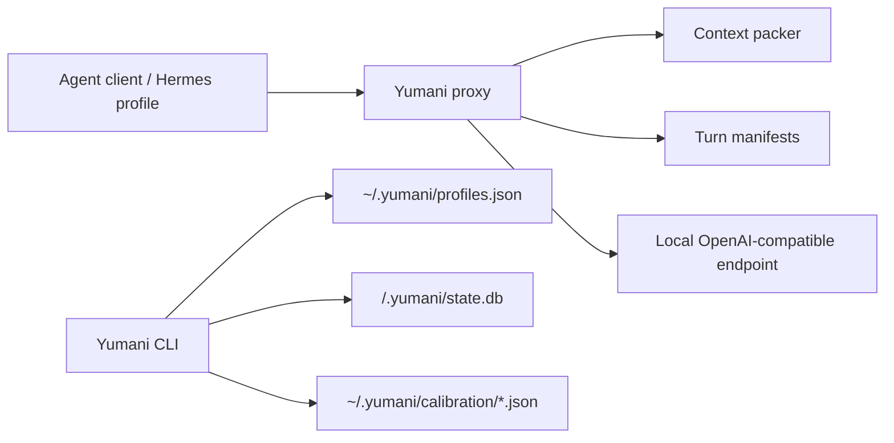

# Architecture

Yumani is a local-only control layer between an agent client and an
OpenAI-compatible local LLM endpoint.

## Boundaries

- Yumani is opt-in by profile.
- Cloud-looking profile names are rejected by default.
- Only loopback HTTP endpoints are accepted by default.
- Project state lives under `.yumani`, not in the model or client profile.
- Wrapper observations are authoritative; model claims are attributed evidence.

## Components

1. **Profile Registry**
   - Stored in `~/.yumani/profiles.json`.
   - Holds endpoint, model id, token budgets, adapter type, and recovery metadata.

2. **Context Packer**
   - Builds deterministic prompt packs from user request, selected files, and
     wrapper facts.
   - Uses conservative token estimation and drops elastic sections before hard
     sections.

3. **Proxy**
   - Exposes `/health`, `/v1/models`, and `/v1/chat/completions`.
   - Packs chat messages before forwarding them.
   - Caps output tokens.
   - Writes per-turn manifests.

4. **State Store**
   - SQLite/WAL database under `<project>/.yumani/state.db`.
   - Records runs, events, observed results, and model claims.

5. **Calibration**
   - Fingerprints the endpoint and model list.
   - Runs an empirical boundary search.
   - Stores safe budgets under `~/.yumani/calibration`.

## Why Not Hardcode q36?

The q36 harness proved the pattern, but the product must survive model swaps.
Therefore q36-specific assumptions became profile fields:

- model id;
- endpoint URL;
- token budgets;
- state directory;
- recovery tool name;
- adapter notes.

